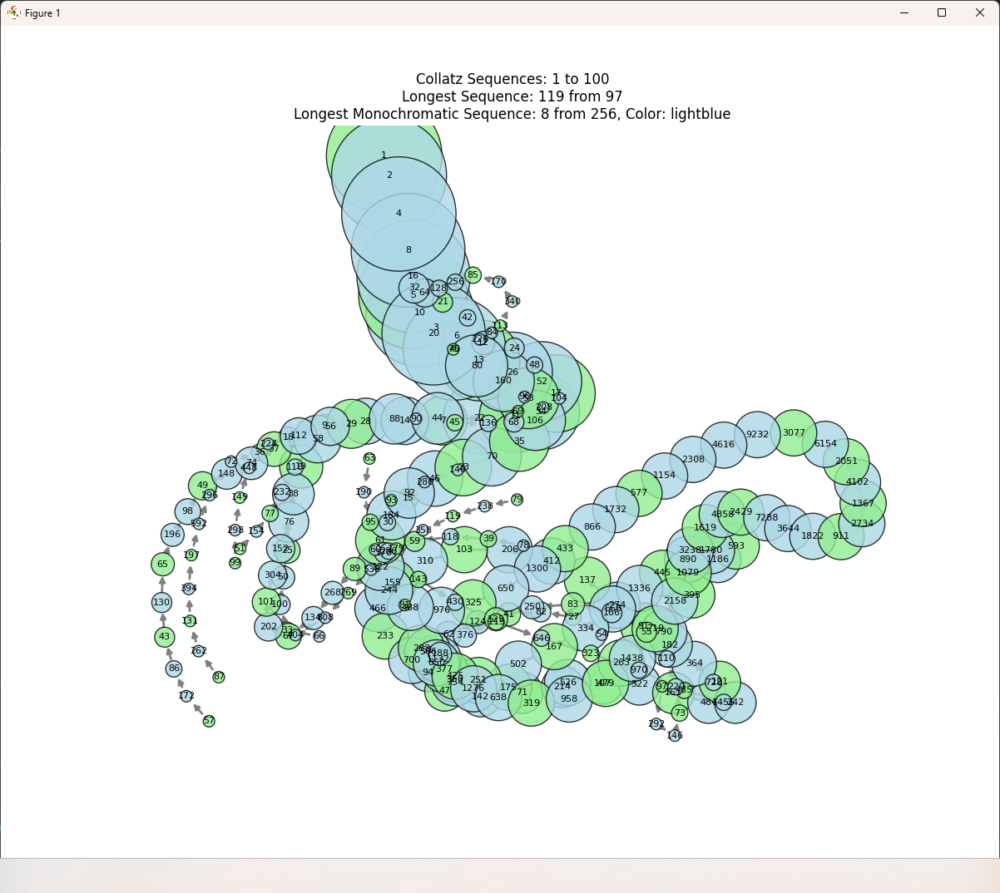

# Collatz_Explore

Exploration of the Collatz Conjecture, experimentally verified by many, proven by none.

Range of 100

Range of 10,000

## License

This project is free to use and modify as licensed under the MIT license. See the [LICENSE](LICENSE) file for more details.
